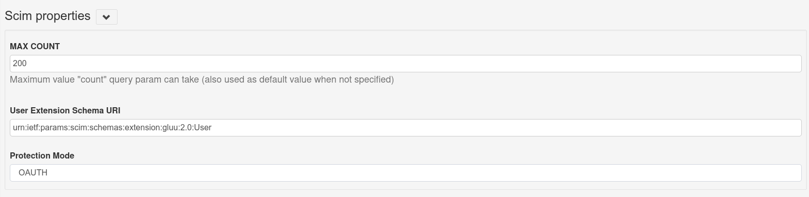
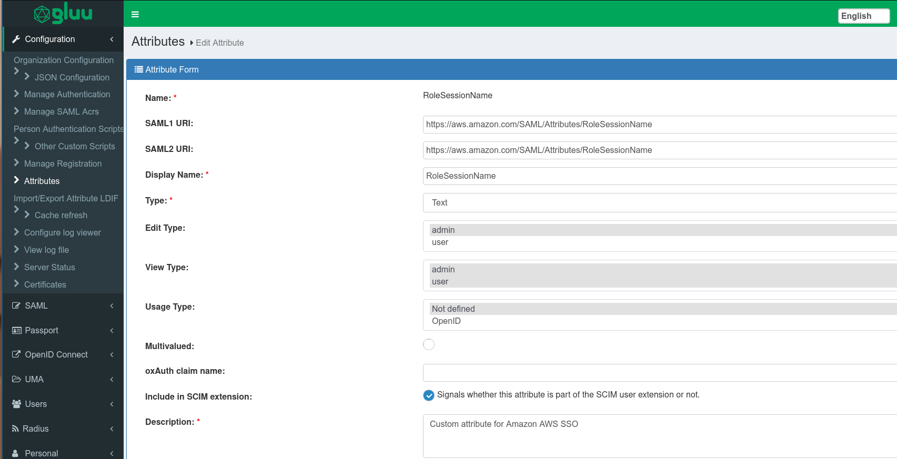
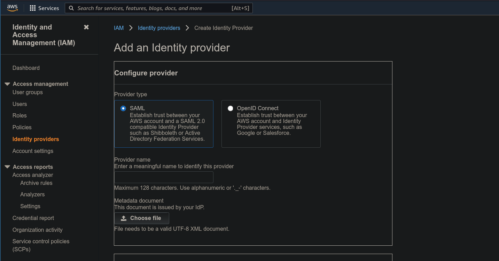
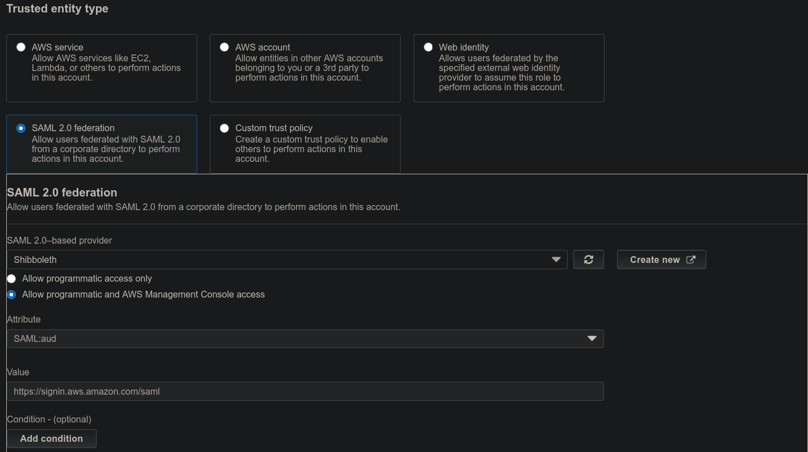
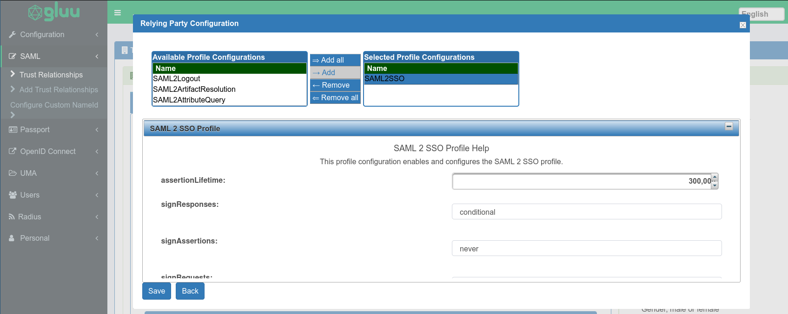
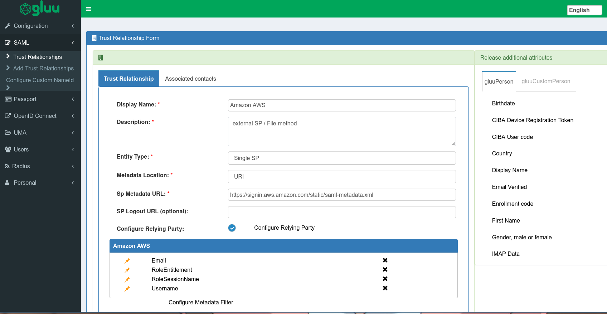
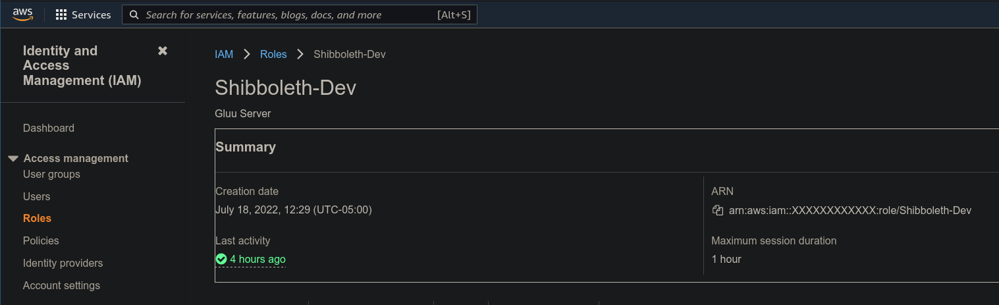
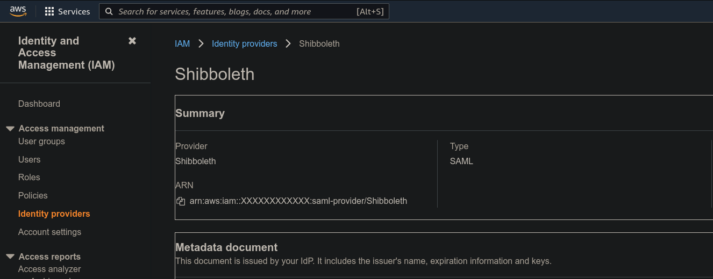
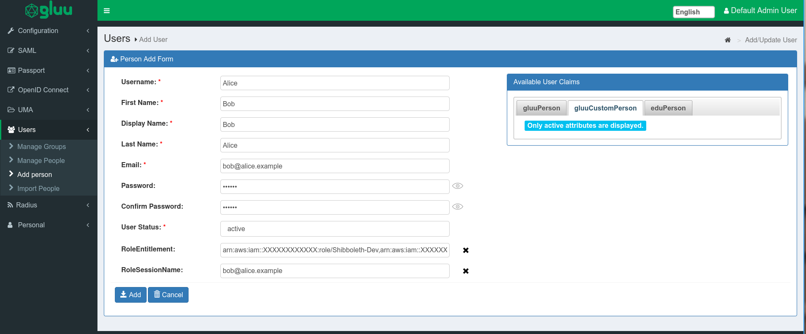
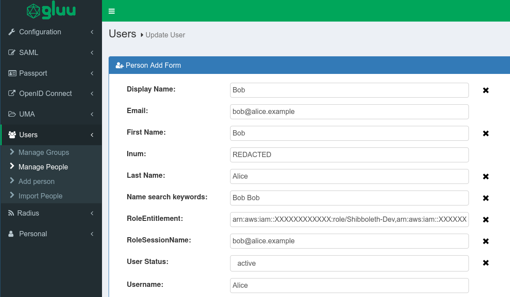

# SCIM support on Gluu Solo for external SSO

This article will guide you through setting up SCIM on your Gluu Solo instance, in order to create/modify/delete users that can seamlessly use Single-Sign-On (SSO) on an external application. For this example, we will be using Gluu Solo 4.4.0.Final with Amazon Web Services as the external application.

## Table of contents

1. [Requirements](#requirements)
2. [Preparing the Gluu Server](#preparing-the-gluu-server)
3. [Configuring AWS to accept SAML requests](#configuring-aws-to-accept-saml-requests)
4. [Creating a Trust relationship in Gluu Server](#create-trust-relationship-in-gluu-server)
5. [Creating a test user manually](#create-the-test-user-manually)
6. [Setup for SCIM](#setup-for-scim)
7. [Setting up scim-client](#setting-up-scim-client)
8. [Creating user for SSO through SCIM](#creating-user-for-sso-through-scim)
9. [Updating a user](#updating-a-user)
10. [Deleting a user](#deleting-a-user)

## Requirements

1. A working Gluu Solo instance
2. An AWS account with administrative priviledges
3. An email address associated with an AWS account that you want to SSO with
4. A way to craft SCIM requests for an endpoint protected by [OAuth 2.0](https://datatracker.ietf.org/doc/html/rfc6749).

## Preparing the Gluu Server

To begin, ensure the Shibboleth IDP and SCIM are installed and enabled on your Gluu installation. On Gluu Solo, both of these are installed by default.

Next, we need to enable the SCIM API. Log onto the oxTrust GUI, go to `Organization` > `Organization Configuration` and check the tick mark for `SCIM Support`.


After that, navigate to `Configuration` > `JSON Configuration` > `OxTrust Configuration`, locate the `Scim Properties` section (use Ctrl + F and search for `Scim`) and set the protection mode to `OAUTH`. Then save the configuration at the bottom of the page.

- This article assumes that we are using the OAuth2 protection scheme. For testing purposes, you may use the `TEST` scheme, which is unprotected and can be queried without any authentication; however, this is not recommended in a production environment.



Our Gluu server is now ready to accept authorized SCIM requests.

Next, we need to add two custom attribute types to our Gluu LDAP.

1. SSH into your Gluu server, and open `/opt/opendj/config/schema/77-customAttributes.ldif` with your favorite editor.
2. Add the following `attributeTypes`, and then modify your `gluuCustomPerson objectClass` to add those two `attributeTypes`. Here is a part of our schema doc after modification:

    ```
    ...
    attributeTypes: ( 1.3.6.1.4.1.48710.1.3.1003 NAME 'RoleEntitlement'
    EQUALITY caseIgnoreMatch
    SUBSTR caseIgnoreSubstringsMatch
    SYNTAX 1.3.6.1.4.1.1466.115.121.1.15
    X-ORIGIN 'Gluu - AWS Assume Role' )
    attributeTypes: ( 1.3.6.1.4.1.48710.1.3.1004 NAME 'RoleSessionName'
    EQUALITY caseIgnoreMatch
    SUBSTR caseIgnoreSubstringsMatch
    SYNTAX 1.3.6.1.4.1.1466.115.121.1.15
    X-ORIGIN 'Gluu - AWS Assume Role Session Name' )
    objectClasses: ( 1.3.6.1.4.1.48710.1.4.101 NAME 'gluuCustomPerson'
    SUP ( top )
    AUXILIARY
    MAY ( telephoneNumber $ mobile $ RoleEntitlement $ RoleSessionName )
    X-ORIGIN 'Gluu - Custom persom objectclass' )
    ```

    **Warning**: Do NOT replace your `objectClasses` with the example above. Simply add `" $ RoleEntitlement "` and `" $ RoleSessionName "` without the quotes to the `MAY` field, as shown in the example. Be careful of spacing; there must be 2 spaces before and 1 after every entry (i.e. DESC), or your custom schema will fail to load properly because of a validation error. You cannot have line spaces between attributeTypes: or objectClasses:. This will cause failure in schema. Please check the error logs in `/opt/opendj/logs/errors` if you are experiencing issues with adding custom schema. In addition, make sure the attributeTypes LDAP ID number is unique. 

3. Save the file, and [restart](https://gluu.org/docs/gluu-server/4.4/operation/services/#restart) the opendj service.
4. Now, we need to register two attributes in oxTrust corresponding to the LDAP attributes we just added. Log onto the web GUI, navigate to `Configuration` > `Attributes` > `Register Attribute`.
5. For the first attribute:
    - Name: `RoleEntitlement`
    - SAML1 URI: `https://aws.amazon.com/SAML/Attributes/Role`
    - SAML2 URI: `https://aws.amazon.com/SAML/Attributes/Role`
    - Display Name: `RoleEntitlement`
    - Type: Text
    - Edit type: `admin`
    - View type: `admin`, `user` (use Ctrl+click to select multiple)
    - Usage type: Not Defined
    - Multivalued: False
    - Tick the box next to `Include in SCIM extension:`
    - Description: `Custom attribute for Amazon AWS SSO`
    - Status: Active
    - Click `Register`

        

6. For the second attribute:
    - Name: `RoleSessionName`
    - SAML1 URI: `https://aws.amazon.com/SAML/Attributes/RoleSessionName`
    - SAML2 URI: `https://aws.amazon.com/SAML/Attributes/RoleSessionName`
    - Display Name: `RoleSessionName`

    Every other field will have the same values as the first attribute.

    

7. If everything is successful, these two attributes will successfully be saved and will show up under the `Attributes` tab. If you get an error saying the attributes don't exist, there was probably an error in your custom schema doc. Refer to the logs for more information.

## Configuring AWS to accept SAML requests
1. Navigate to `https://<hostname>/idp/shibboleth` on your Gluu server and download the page as an XML file.
2. Log into the AWS Management Console with an administrator account. Find and navigate to the IAM module.
3. Create an IDP on your AWS account with the following steps:
    - On the left hand pane, choose `Identity Providers`
    - Click on `Add Provider`
    - Provider type: `SAML`
    - Provider name: `Shibboleth`
    - Metadata document: Upload the XML file you downloaded.
    - Click `Add Provider` at the bottom.

    

4. Create a role associated with the new IDP with the following steps:
    - On the left hand pane, choose `Roles`
    - Trusted Entity Type: `SAML 2.0 Federation`
    - SAML 2.0 Based Provider: `Shibboleth` (or what you chose for provider name previously) from the drop down menu.
    - Tick `Allow programmatic and AWS Management Console Access`
    - The rest of the fields will autofill.

        

    - Click `Next`. Here you may choose policies to associate with this role. Refer to [AWS documentation](https://docs.aws.amazon.com/IAM/latest/UserGuide/id_roles_create_for-idp_saml.html) for further information. For this example, we are not choosing any policies, and instead clicking `Next`.
    - Role name: `Shibboleth-Dev`
    - Role description: Choose a meaningful description. 
    - Verify that the Role Trust JSON looks like this (the X's will be some unique string):

        ```json
        {
            "Version": "2012-10-17",
            "Statement": [
                {
                    "Effect": "Allow",
                    "Action": "sts:AssumeRoleWithSAML",
                    "Principal": {
                        "Federated": "arn:aws:iam::xxxxxxxxxxxx:saml-provider/Shibboleth"
                    },
                    "Condition": {
                        "StringEquals": {
                            "SAML:aud": [
                                "https://signin.aws.amazon.com/saml"
                            ]
                        }
                    }
                }
            ]
        }
        ```
    - Finally, click on `Create Role`.

AWS is now ready to accept inbound SAML.

## Create Trust Relationship in Gluu Server

Now we need to create an outbound SAML trust relationship from the Gluu Server to AWS. 

1. Log onto the web GUI
2. Navigate to `SAML` > `Add Trust Relationship`
3. Use the following values:
    - Display Name: `Amazon AWS`
    - Description: `external SP / File method`
    - Entity Type: `Single SP` from the dropdown
    - Metadata location: `URI` from the dropdown
    - SP metadata URL: `https://signin.aws.amazon.com/static/saml-metadata.xml`
    - Check the box next to `Configure relying party` and an additional box will pop up.
        - Click on `SAML2SSO` and click Add; then expand the SAML2 SSO Profile menu.
        

        - Use the following values:
        - `includeAtributeStatemen`: yes
        - `assertionLifetime`: 300000
        - `signResponses`: conditional
        - `signAssertions`: never
        - `signRequests`: conditional
        - `encryptAssertions`: never
        - `encryptNameIds`: never
        - Click `Save`
    - On the right hand side, under `Release additional attributes`, there is a list of attributes that can be released to this relationship. From those, choose the following:
        - From `gluuPerson`, click on `Email` and `Username`
        - From `gluuCustomPerson`, click on `RoleEntitlement` and `RoleSessionName`
            
4. Save this trust relationship. It will take some time to fully load, so please wait.

## Create the test user manually

Now we will create a test user on the Gluu server to check whether the outbound SAML works. Later, we will do this via SCIM requests. This user needs to have an email that is authorized to access the AWS account we want to sign on to. For this example, we will use dummy details. You will want to use your own details. 

First, we need to get some values from our AWS account. Log onto AWS.

1. For the first value, navigate to `Roles` and click on the role you created for the SAML relationship. Copy the ARN, which for us is in the format `arn:aws:iam::XXXXXXXXXXXX:role/Shibboleth-Dev`, with numbers replacing the Xs. Note this down.

    

2. For the second value, navigate to `Identity providers` and click on the provider you created. Copy the ARN, which should be in a similar format. For us it is `arn:aws:iam::XXXXXXXXXXXX:saml-provider/Shibboleth`, with numbers replacing the Xs. Note this down as well.

    

3. From the oxTrust GUI, navigate to `Users` > `Add person`
4. Our example values are as follows:
    - `Username`: Alice
    - `First Name`: Bob
    - `Display Name`: Bob
    - `Last Name`: Alice
    - `Email`: bob@alice.example
    - `Password`: any password
    - `Confirm Password`: repeat the password
    - `User Status`: Active
    - From the right hand side, click on the `gluuCustomPerson` class and click on the two custom attributes. They will show up as entry fields in the form to the left.
    - `RoleEntitlement`: The first value and the second value from steps 1 and 2, separated by a comma. For us it is `arn:aws:iam::XXXXXXXXXXXX:role/Shibboleth-Dev,arn:aws:iam::XXXXXXXXXXXX:saml-provider/Shibboleth`.
    - RoleSessionName: The email address that will be used to log onto AWS. We will use a dummy value, `bob@alice.example`.

    

5. Click Add. Our new user should look like this:

    

## Testing SSO
Before using SCIM, we recommend testing out the SAML flow to SSO onto Amazon. To do this, simply visit `https://<hostname>/idp/profile/SAML2/Unsolicited/SSO?providerId=urn:amazon:webservices` and use your new Gluu user. This will start an IDP initiated SAML flow, which will allow you to log onto AWS without any additional steps.

### Steps involving a SCIM query

Communicating with a SCIM endpoint that is protected by OAuth is not a trivial setup. There are several authentication steps involved due to security concerns. The process is simplified to the following steps:

0. If this is the first time a query is being made, the requesting party registers a new client with the Gluu server using OpenID Connect [dynamic client registration](https://openid.net/specs/openid-connect-registration-1_0.html) with the appropriate [scopes](https://gluu.org/docs/gluu-server/4.4/user-management/scim2/#client-scopes). The RP will choose an OAuth authorization flow to obtain access tokens. The [client_credentials](https://www.rfc-editor.org/rfc/rfc6749#section-4.4) flow is the easiest to use and so this is the recommended option.
1. The client requests an OAuth access token using some OpenID Connect authentication method. Supported methods are `client_secret_basic`, `client_secret_post`, `client_secret_jwt`, and `private_key_jwt`. For more security, asymmetric key authentication is recommended. Please refer to [OpenID Connect Client Authentication](https://openid.net/specs/openid-connect-core-1_0-15.html#ClientAuthentication) for more details.
2. This access token is used to make SCIM queries.

For this example, we will be using the Java `scim-client` with `client_credentials` and `private_key_jwt`. Please choose a method that is suitable for your production environment.
## Setup for scim-client

1. An [RS256](https://www.rfc-editor.org/rfc/rfc7518#section-3.3) key pair and an associated certificate for our client and the Gluu server to communicate through.
2. A keystore file that contains the private key and the associated certificate (or chain). You may use [PKCS12](https://www.rfc-editor.org/rfc/rfc7292) or [JKS](https://docs.oracle.com/cd/E19509-01/820-3503/ggfen/index.html).
3. The public key of the key pair in [JSON web key](https://datatracker.ietf.org/doc/html/rfc7517) format, preferably saved to a file. 
4. The SSL certificate of our Gluu server, which can be found at `/opt/gluu-server/etc/certs/httpd.crt`. You can obtain this by using `scp`.

### Generating keys
You will need Java 11 (and keytool) along with OpenSSL installed on your machine. Run the following command in a new directory to generate a private key; enter a passcode when prompted and remember it.
```
openssl genrsa -des3 -out private-key.pem 2048
```
Next, generate the associated public key with the following command:
```
openssl rsa -in private-key.pem -pubout -out public-key.pem
```
It will ask you for the password for the private key; enter when prompted.
Finally, generate a self-signed certificate for the key pair:
```
openssl req -new -x509 -key private-key.pem -out cert.pem -days 360
```
You will be prompted for the private key password and some distinguished values necessary for generating a certificate. In a test environment you may use dummy values. However, in a production environment you will want to use appropriate values.

You should now have three files:
- private-key.pem
- public-key.pem
- cert.pem

### Creating new keystore
First we need to concatenate the private key and certificate to one file.
```
cat private-key.pem cert.pem > import.pem
```
Next, we need to convert this file to a PKCS12 keystore.
```
openssl pkcs12 -export -in import.pem -name bob > client-keystore.pkcs12
```
Replace `bob` with some name you can remember. It will prompt you for the private key password, then a new password for the PKCS12 keystore.

### Creating a JSON web key set
1. Visit https://russelldavies.github.io/jwk-creator/.
2. Fill in the following details:
    - Public Key Use: Signing
    - Algorithm: RS256
    - Key ID: The alias you chose. For us it is `bob`.
    - PEM encoded key: The public key you generated, from `public-key.pem`.
3. Click `Convert`,  and save the output on the right to a file. Name it `client-key.jwks`.

At this point you should have the following files:
- `client-keystore.pkcs12`
- `client-key.jwks`

### Dynamic Client Registration using OpenID connect
For your convenience, I have created a Python script for you which can automate this process. Visit https://github.com/SafinWasi/gluu_openid_python and follow the instructions in the README. The script can either use the JWKS file or not, but for this tutorial we will be using the JWKS file. Once it's done, you should have a `client.json` file that contains the Client ID and secret. Do not share this information.

If you wish to do this manually, please refer to [Dynamic Client Registration](https://openid.net/specs/openid-connect-registration-1_0.html).

### Allowing the new client access to SCIM
By default, the new client does not have access to SCIM scopes. To allow this:
- Login to oxTrust and locate the client created for interaction with SCIM. This should be easy to do by searching for the client name you provided.
- Click the "Add Scope" button.
- Tick the scopes prefixed by `https://gluu.org/scim`. The kind of access every scope grants is displayed on the right column. It may be helpful to sort the scopes list by name.

You may add scopes to the client as you need. For a full list, visit `Scopes` in oxTrust. For our example, we will add `https://gluu.org/scim/users.read`, which is for querying and searching user resources.

## Setting up scim-client
For this article, we will be using [scim-client](https://github.com/GluuFederation/scim/tree/master/scim-client) version 4.4.0. Ideally, you will want to use the version that is the same as your Gluu server. Requisites for using scim-client in OAuth mode are as follows:

- Entry-level knowledge of Java is enough. Make sure you have Java 11 or higher installed. The use of Maven as a build tool is recommended.
- Add the SSL certificate of your Gluu server to the cacerts keystore of your local Java installation. If you are using a self-signed certificate, you can find it at `/opt/gluu-server/etc/certs/httpd.crt`. You can add this to your cacerts keystore with the following command:
    ```
    # keytool -importcert -trustcacerts -cacerts -file httpd.crt
    ```
- Online Java-docs for scim-client are available [here](https://maven.gluu.org/javadocs/scim/version_4.4.0/client/). You can generate java-docs locally too using Maven; just run `mvn javadoc:javadoc -pl scim-client`.
- Create a simple project in your Java IDE. There are two ways of using scim-client: obtain the JAR file [here](https://maven.gluu.org/maven/org/gluu/scim-client/), or use Maven. If you choose to obtain the JAR file, import it as an external dependency. If you're using Maven, add the following snippets to your  `pom.xml`:
    ```xml
    <properties>
        <scim.client.version>4.4.0.Final</scim.client.version>
    </properties>
    ...
    <repositories>
    <repository>
        <id>gluu</id>
        <name>Gluu repository</name>
        <url>https://maven.gluu.org/maven</url>
    </repository>
    </repositories>
    ...
    <dependency>
    <groupId>org.gluu</groupId>
    <artifactId>scim-client</artifactId>
    <version>${scim.client.version}</version>
    </dependency>
    ```
    Then run `mvn install` in your project directory. This will download and build the necessary dependencies. We will also be using [Apache Log4j2](https://logging.apache.org/log4j/2.x/index.html), so be sure to obtain it either directly or through maven. Set up log4j to log to console for all log levels. Refer to the [documentation](https://logging.apache.org/log4j/2.x/manual/configuration.html) on how to do this.

    **Warning**: The current build of scim-client on maven contains a bug that causes operation in OAuth mode with private JWK pair authentication impossible. This has been fixed on the master branch of the source code. A possible workaround is to clone the [repository](https://github.com/GluuFederation/scim/tree/master/scim-client) and build scim-client locally, then import the JAR. For this example we are using version 4.4.0.Final.
- To begin testing, we will query our "Alice" user. Set up a new class named `TestOauthClient` and fill in the class as follows:
    ```java
    import gluu.scim2.client.factory.ScimClientFactory;
    import gluu.scim2.client.rest.ClientSideService;
    import org.apache.logging.log4j.LogManager;
    import org.apache.logging.log4j.Logger;
    import org.gluu.oxtrust.model.scim2.BaseScimResource;
    import org.gluu.oxtrust.model.scim2.ListResponse;
    import org.gluu.oxtrust.model.scim2.user.UserResource;
    import org.gluu.oxtrust.model.scim2.user.Name;
    import org.gluu.oxtrust.model.scim2.user.Email;


    import javax.ws.rs.core.Response;
    import java.util.List;

    public class TestOauthClient {

        private String domainURL = "https://<host-name>/identity/restv1";
        private String OIDCMetadataUrl = "https://<host-name>/.well-known/openid-configuration";
        private String clientId = "<your client ID>";
        private String keyPath = "<path to your Java keystore file>";
        Path path = Paths.get(keyPath);
        private String keyStorePassword = "<your keystore password>";
        private String keyId = "<alias for the key in your keystore>";

        private Logger logger = LogManager.getLogger(getClass());

        private void simpleSearch() throws Exception {

            ClientSideService client = ScimClientFactory.getOAuthClient(domainURL, OIDCMetadataUrl, clientId, path,keyStorePassword, keyId);
            String filter = "userName eq \"Alice\"";

            Response response = client.searchUsers(filter, 1, 1, null, null, null, null);
            List<BaseScimResource> resources = response.readEntity(ListResponse.class).getResources();

            logger.info("Length of results list is: {}", resources.size());
            UserResource admin = (UserResource) resources.get(0);
            logger.info("First user in the list is: {}", admin.getDisplayName());

            client.close();

        }

        public static void main(String[] args) {
            TestOauthClient client = new TestOauthClient();
            try {
                client.simpleSearch();
            } catch(Exception e) {
                System.out.println(e);
            }
        }

    }
    ```
- Then run the main class. If everything runs properly, the logger should log the entire authentication process and output a single user, with the "Alice" username.

## Creating user for SSO through SCIM
The SCIM API provides request verbs similar to HTTP requests for operation. The verbs are as follows: `GET`, `POST`, `PUT`, `PATCH`, `DELETE`. A summary of these verbs can be found [here](https://gluu.org/docs/gluu-server/4.4/api-guide/scim-api/#http-verbs). For the scim-client implementations of these requests, you can check the [javadocs](https://maven.gluu.org/javadocs/scim/version_4.4.0/model/org/gluu/oxtrust/ws/rs/scim2/IUserWebService.html). For creating a new user, we will be using the `POST` request.

While creating a user for SSO to AWS, the user needs to have two custom attributes, `RoleSessionName` and `RoleEntitlement`. For this, the client we're using will need access to the `https://gluu.org/scim/users.write` scope, so grant it in oxTrust. We can use scim-client libraries to create a new user and add those attributes. For us, the code stands as such:
```java
private void createUser() throws Exception {
    ClientSideService client = ScimClientFactory.getOAuthClient(domainURL, OIDCMetadataUrl, clientId, path, keyStorePassword, keyId);

    // Creating a new user
    UserResource user = new UserResource();

    Name name = new Name();
    name.setGivenName("John");
    name.setFamilyName("Doe");
    user.setName(name);

    user.setActive(true);
    user.setUserName("JohnDoe");
    // Do not do this in a production environment:
    user.setPassword("changeit");

    List<Email> emailList = new ArrayList<Email>();
    Email email = new Email();
    email.setPrimary(true);
    email.setType("work");
    email.setValue("johndoe@example.com");
    emailList.add(email);
    user.setEmails(emailList);

    /*  Use the URI associated with the custom extension of these attributes. You can find this in oxTrust
        under Configuration > JSON Configuration > OxTrust Configuration > Scim properties
    */
    CustomAttributes attributes = new CustomAttributes("urn:ietf:params:scim:schemas:extension:gluu:2.0:User");
    // This needs to have access to AWS
    attributes.setAttribute("RoleSessionName", "johndoe@example.com");
    // Replace Xs with your ARN numbers
    attributes.setAttribute("RoleEntitlement", "arn:aws:iam::XXXXXXXXXXXX:role/Shibboleth-Dev,arn:aws:iam::XXXXXXXXXXXX:saml-provider/Shibboleth");
    user.addCustomAttributes(attributes);

    // This is the POST request
    Response response = client.createUser(user, null, null);
    logger.info("response HTTP code = {}", response.getStatus());
    client.close();
}

```

If everything was successful, you should get a response code of 201 and the user should show up under `Users` > `Manage People` in  oxTrust. You might need to search for the username.

Finally, visit `https://<hostname>/idp/profile/SAML2/Unsolicited/SSO?providerId=urn:amazon:webservices` and log on with this new user. You should be able to log on to AWS with this new account.

## Updating a user
There are two requests that can update a user, `PUT` and `PATCH`. `PUT` is suitable for replacements using non-null values, while `PATCH` is suitable for addition, removal and localized updates of a user resource. Refer to [updateUser()](https://maven.gluu.org/javadocs/scim/version_4.4.0/model/org/gluu/oxtrust/ws/rs/scim2/IUserWebService.html#updateUser(org.gluu.oxtrust.model.scim2.user.UserResource,java.lang.String,java.lang.String,java.lang.String)) and [patchUser()](https://maven.gluu.org/javadocs/scim/version_4.4.0/model/org/gluu/oxtrust/ws/rs/scim2/IUserWebService.html#updateUser(org.gluu.oxtrust.model.scim2.user.UserResource,java.lang.String,java.lang.String,java.lang.String)) of the scim-client documentation for more information.

## Deleting a user
For deleting a user, only the ID (the `inum` attribute in LDAP) is required. You can check this by either going to oxTrust and getting the `inum` of the user or by inspecting the JSON of the response right after the user is created. You will need a way to convert the Java Response object to a JSON representation if you want to do this. A primitive way to do this is `String output = response.readEntity(String.class);`.

```java
Response response = client.deleteUser("ID");
assertEquals(Response.Status.NO_CONTENT.getStatusCode(), response.getStatus());
```

## References
- [Gluu 4.4 Documentation](https://gluu.org/docs/gluu-server/4.4/)
- [OpenID connect dynamic client registration](http://openid.net/specs/openid-connect-registration-1_0.html)
- [OAuth 2.0](http://tools.ietf.org/html/rfc6749)
- SCIM API ([RFC 7642](https://tools.ietf.org/html/rfc7642), [RFC 7643](https://tools.ietf.org/html/rfc7643) and [RFC 7644](https://tools.ietf.org/html/rfc7644))
- [Generating RSA key pairs](https://www.scottbrady91.com/openssl/creating-rsa-keys-using-openssl)
- [Online JWK creator](https://github.com/russelldavies/jwk-creator)