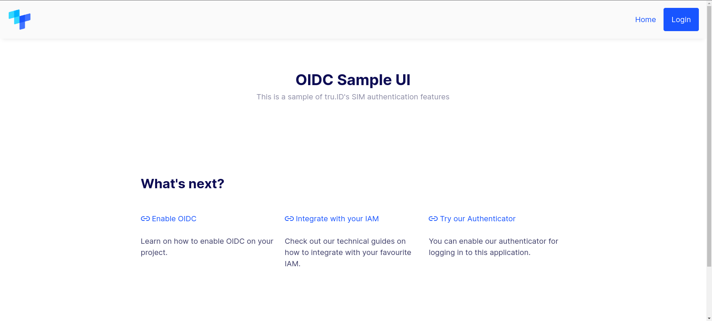
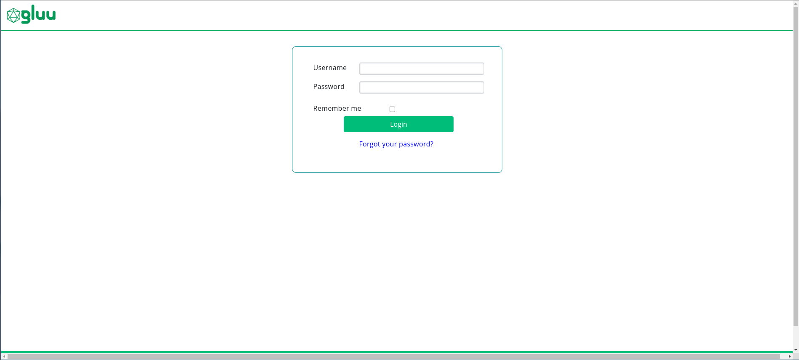
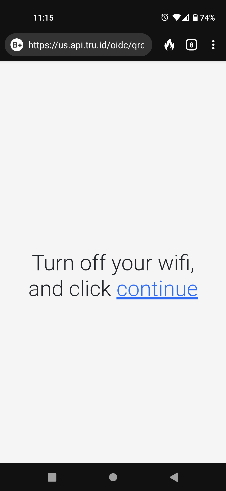
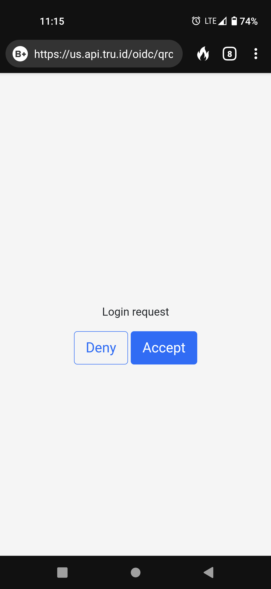
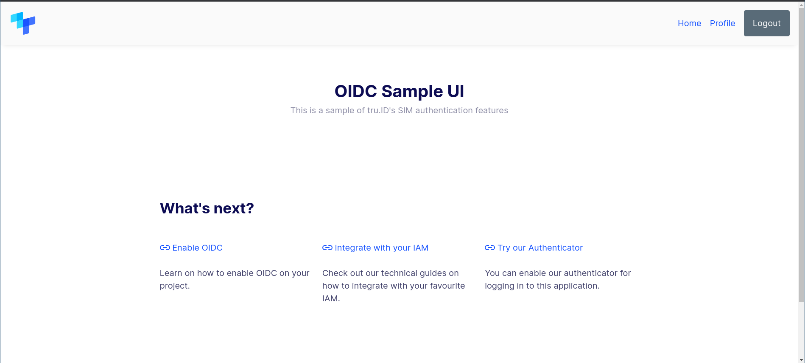

# Integrating Gluu Server with Tru ID

## Introduction

In the current age of digital identity, user authentication is a critical component of any service. The username and password combination that was prevalent everywhere even a decade ago is no longer sufficiently secure. Because of social engineering attacks, data leaks and web vulnerabilities, usernames and even passwords may end up in the hands of malicious actors. As a result, adding more factors of authentication has become a crucial procedure for any service dealing with identity. At present, all forms of human authentication rely on a combination of the following:

- Something you know (e.g. a password)
- Something you have (e.g. your phone or a hardware token)
- Something you are (e.g. your face, voice, or fingerprints)

Each of these authentication factors have their own strengths and weaknesses. A password or a hardware token can be stolen by a malicious actor. Biometric sensors are rather expensive and not very accurate at present. Alone, these factors are not sufficiently secure but a combination of multiple factors may be. An attacker may steal a password, but he may have a difficult time also stealing the target's phone or having them biometrically authenticate. 

Phone number verification is a process where multiple factors are used. For example, a banking website may ask for a password when making a transaction (something you know). In addition, it may send a text message containing a one-time code to be entered into the website (something you have). However, although this method of MFA (multi factor authentication) has become increasingly popular, it is no less susceptible to a sufficiently motivated attacker. A user may be social engineered into entering the one-time code into a phishing website, thus providing the attacker with both the password and the one-time code. As such, phone number verification by itself is not sufficient as a factor of authentication.

## Tru ID

This is where [Tru ID](https://tru.id/) comes in. They propose an alternate way of phone verification: verify that the phone in question is in fact using the SIM card associated with the phone number being used for verification. This ensures that a potential attacker must possess both the victim's phone and a SIM card mapped to the phone number. Tru ID allows you to set up an [OpenID Connect](https://developer.tru.id/docs/oidc/integration) flow, which allows you to enable MFA on your application with Tru's PhoneCheck (verifying possession of an active SIM card with the same number) as an extra factor. If you are using an OpenID Connect compatible IAM (Identity and Access Management) platform, you can easily integrate Tru ID to deploy SIM-based possession factor based MFA login flows. 

This article will demonstrate the use of one such flow obtained by integrating the Tru ID's [sample app](https://github.com/tru-ID/oidc-bridge) with [Gluu Server](https://gluu.org/), an OIDC-certified IAM, for MFA authentication. Here, the first factor is Gluu's username/password login and the second factor is handled by calling Tru ID's PhoneCheck API to verify possession of the SIM card with the phone number. It is important to note that the sample `oidc-bridge` provided by Tru ID needs to be run as a separate service/container which may vary depending on your implementation. The service diagram for the flow is as follows:

## Authentication Flow

1. The user navigates to the application's login page (which in this case is the Tru ID sample app) and clicks on `Login`.

2. Then they are redirected to the Gluu Server oxAuth login page for the first factor authentication.

3. After authentication, they are redirected back to the application, where the call to the PhoneCheck API is made.

4. For this call, the user is shown a QR code on the website which is to be scanned with the user's phone camera.

5. On the phone, the QR code resolves to a URL where they are asked to turn off the WiFi for network verification.

6. Then they are shown a consent screen to allow verification for the web application.

7. Upon allowing access on the phone, the browser logs in to the application.

This was tested using Gluu Server 4.4 and my Android 11 device using DuckDuckGo browser. Most modern Android (>=Android 9) and iOS devices already have QR scanning functionality built right into the camera software, so the only hard requirement on the device is a modern web browser.

## How to setup

Tru ID already has a detailed guide on how to set up integration with Gluu Server [here](https://github.com/tru-ID/oidc-bridge/tree/main/integration-gluu#readme), with their `oidc-bridge` sample application as the example. 